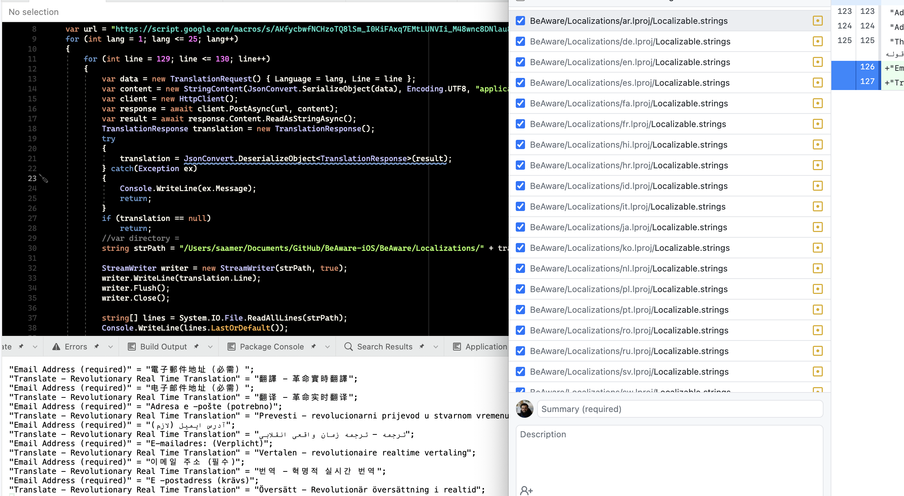
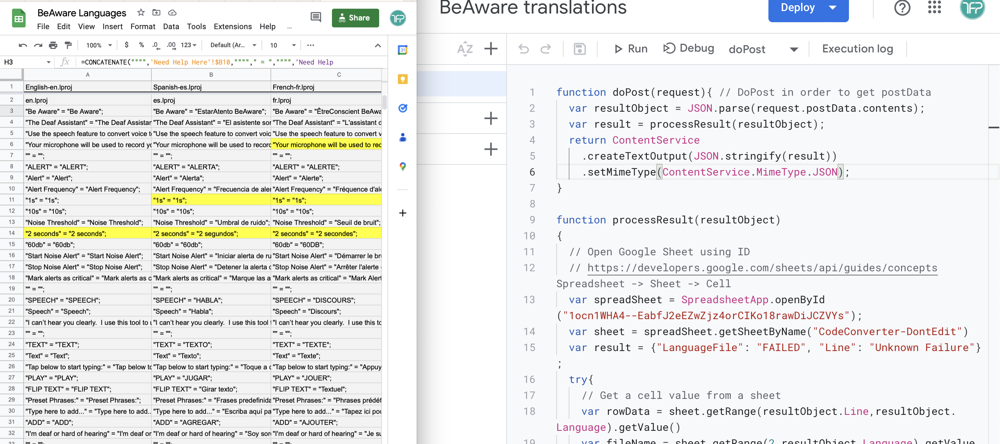

# DotNet GoogleSheet Swift LocalizationsAppender
 A DotNet console application that gets translations from GoogleSheet and adds it to a Swift Localizations file at the end (Append)

I have in the past talked about [how to localize your SwiftUI app](https://docs.google.com/presentation/d/1GXwYenBwiGCInzul9nBy3BHfl1177IGX9y6i9WD8fyI/edit)

Since I have a [free app for the Deaf and Hard of Hearing called BeAware](https://deafassistant.com/app) that is translated to 25 languages, there were still some manual steps involved, the code in this file automates those as well.

 app, I created a #JavaScript AppScript API, that pulls =GOOGLETRANSLATE translations from Google Sheets. Then a #Csharp console app gets values & writes to #Swift App Code localizations files!

## Steps to use this : 

1. Google Sheet with translations:

As you can see in the [translations Google Spreadsheet](https://docs.google.com/spreadsheets/d/1ocn1WHA4--EabfJ2eEZwZjz4orCIKo18rawDiJCZVYs/edit#gid=1560650986), I have the following sheets
- `RawData` is where I add more translations, and automate those using the =GOOGLETRANSLATE() function
- `Need Help Here` is where I paste the new rows as values above the `------ APP STORE` row 
- `CodeConverter` is where I just copy and paste the row above it, and it generates the new translation needed in the format recognized by the `Localizable.strings` file

2. App Script API

- After you have your translations file ready, in the Spreadsheet toolbar, go to `Extensions`-> `Apps Script`
- Then paste in the code from the [AppScriptCode.js](AppScriptCode.js) file, replacing line 13 with your Spreadsheet Id, and Save
- You can test to see it in action by changing `doPost` in the drop down to `test` and saying Run, while changing the line and language based on the column and row number
- Then `Deploy` as a `Web App` and make sure it's viewable to `Anyone`, and get the URL that is shared in this format `https://script.google.com/macros/s/YourUrl/exec`
- You can test the API in Postman by putting in a raw body using a `POST` request with the URL from above and a raw JSON body as shown: `{"Line": 12, "Language": 1}`

3. DotNet Console app

- Open the console application in Visual Studio, or else if you don't want to install VS for Mac, you can [install Dotnet 7 from here](https://dotnet.microsoft.com/en-us/download)
- Restoring nuget packages happens automatically on Visual Studio. If running through the terminal, run `dotnet restore`
- Update lines 9, 18, 40 of the [Program.cs file](SwiftLocalizationsAppender/SwiftLocalizationsAppender/Program.cs) with your requirements 
- Then every time you have to add translation, just update lines 19 & 20, & hit play if using Visual Studio or execute `dotnet run` on VS Code

Voilà! You should see the required translations show up correctly in the right Localizable.strings file

### Screenshots

### Updates

* Added the ability to update the InfoPlist.strings files as well using the MakeCFBundleNameAPICall and MakeCFBundleDisplayNameAPICall functions. You have to update google sheet to show CFBundleName and CFBundleDisplayName on the left and just run one function after the other